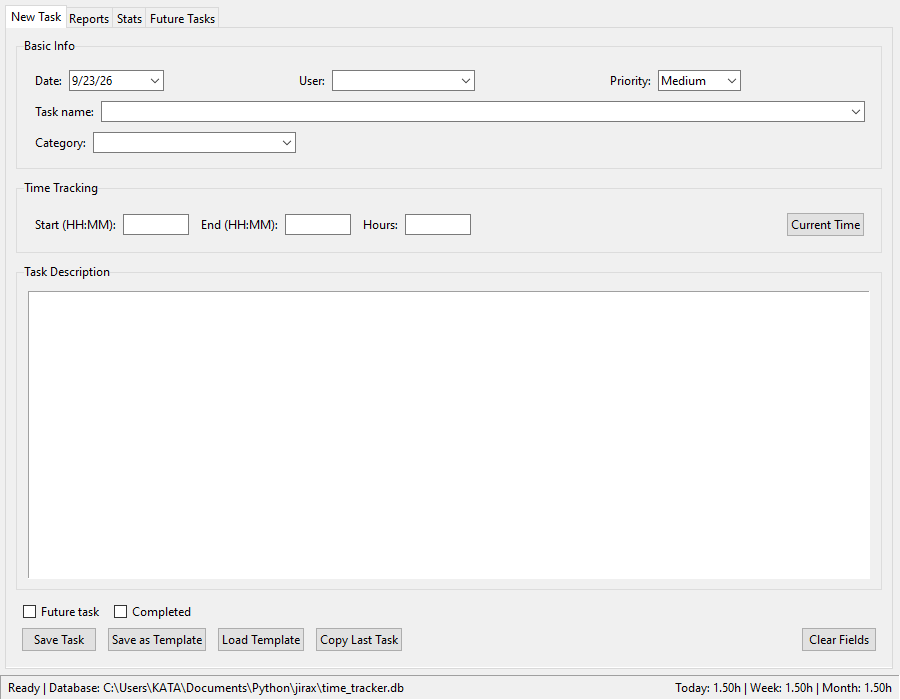
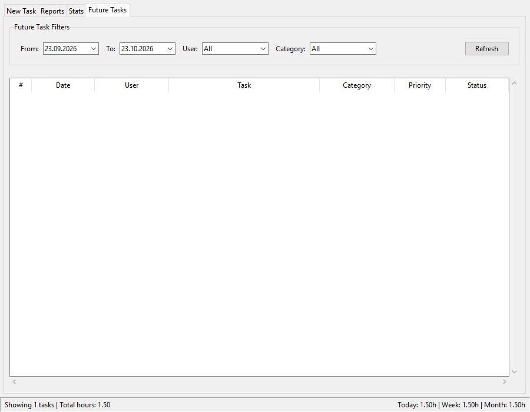

# JiraX — Time Tracker

JiraX is a desktop time-tracking app for small IT/support teams and individuals who want to quickly log what they worked on, how many hours it took, and for which client or category — no account, no internet connection, and no external tool like Jira required.



## Why JiraX

- **Local and private** — all data is stored in a single SQLite file on your machine; nothing is sent to a server.
- **Fast entry** — date, user, category, start/end time or a direct hours entry, with auto-suggestions based on previous tasks.
- **Reports and statistics** — breakdowns by day, user and category, with export to a formatted Excel file (`Reports` and `Stats` tabs).
- **Planning** — a dedicated tab for future/planned tasks, which you can move into active tasks with one click.
- **Templates** — save frequently used tasks as templates for faster re-entry.

## Who this is for

IT support staff, freelancers, consultants and small teams who track daily work by client/category and occasionally need to export a report (e.g. for invoicing or internal stats), without wanting to configure a full project-management tool.

## Screenshots

| New Task | Reports |
|---|---|
|  |  |

| Stats | Future Tasks |
|---|---|
|  |  |

## Installation and usage

Requires Python 3.10+.

```bash
git clone https://github.com/radojkovicm/jirax.git
cd jirax
pip install -r requirements.txt
python main.py
```

The database (`time_tracker.db`) and its schema are created automatically on first run, in the same folder — no manual setup needed.

## Build (standalone Windows .exe)

The project includes `TimeTrackerApp.spec` for [PyInstaller](https://pyinstaller.org/):

```bash
pip install pyinstaller
pyinstaller TimeTrackerApp.spec
```

The finished `.exe` will be in `dist/TimeTrackerApp/`.

## Project structure

```
main.py        - application entry point
database.py    - SQLite schema and connection
gui.py         - Tkinter UI (task entry, reports, stats, future tasks)
export.py      - formatted Excel export for reports/statistics
```

## Notes on data

Default categories are created automatically on first run; the user list starts empty and fills in as soon as you type a name into the "User" field. `time_tracker.db` is not part of the repository (see `.gitignore`) since it holds personal/business data — each installation keeps its own local database.

## License

[MIT](LICENSE)
