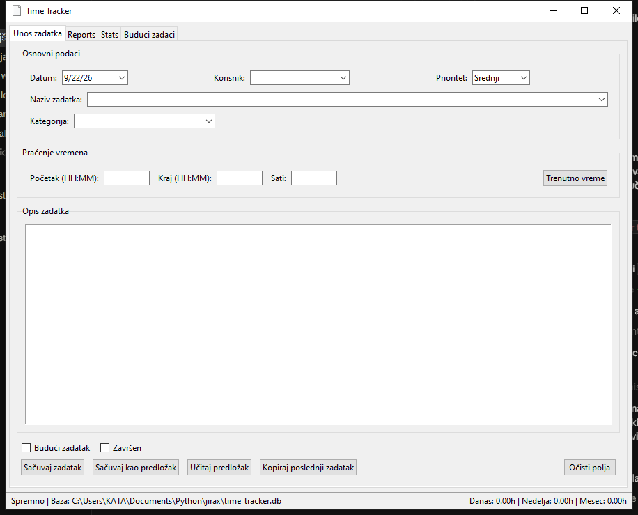
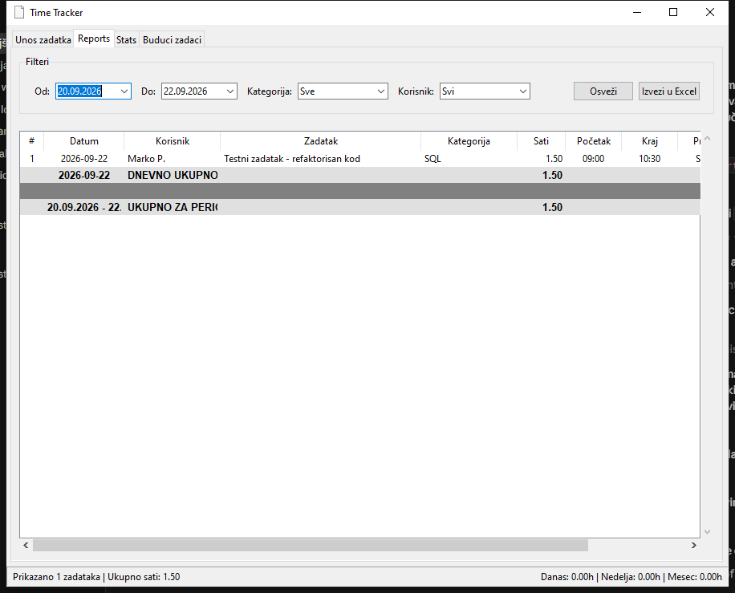
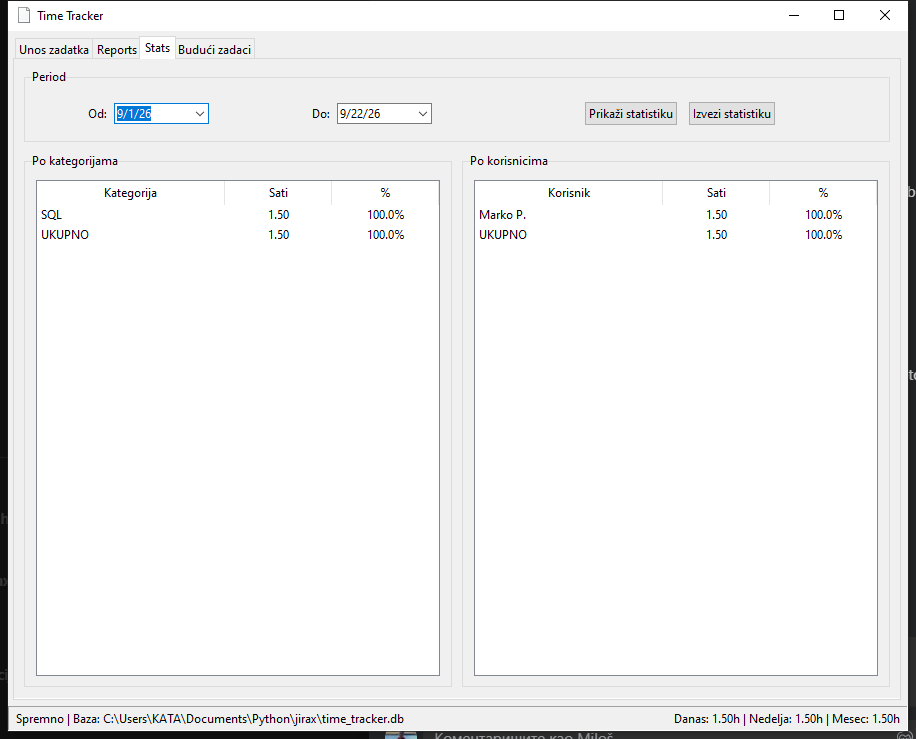
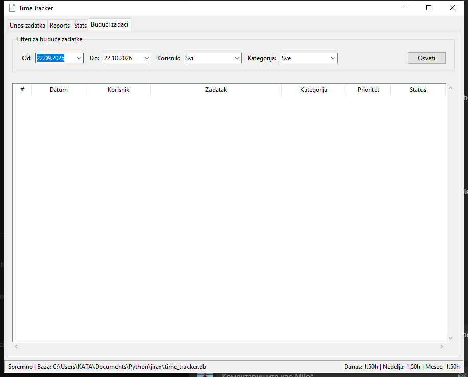

# JiraX — Time Tracker

JiraX je desktop aplikacija za praćenje radnog vremena namenjena malim IT/support timovima i pojedincima koji žele brzo da beleže na čemu su radili, koliko sati su utrošili i za kog klijenta ili kategoriju — bez potrebe za nalogom, internetom ili eksternim alatom poput Jire.



## Zašto JiraX

- **Lokalno i privatno** — svi podaci se čuvaju u jednom SQLite fajlu na vašem računaru, ništa se ne šalje na server.
- **Brz unos** — datum, korisnik, kategorija, početak/kraj vremena ili direktan unos broja sati, uz auto-predloge na osnovu prethodnih zadataka.
- **Izveštaji i statistika** — pregled po danu, korisniku i kategoriji, sa izvozom u formatiran Excel fajl (`Reports` i `Stats` tabovi).
- **Planiranje** — poseban tab za buduće/planirane zadatke, koje kasnije jednim klikom prebacujete u aktivne.
- **Predlošci** — čuvanje čestih zadataka kao predložak za brži ponovni unos.

## Ko treba da koristi ovaj alat

IT podrška, freelanceri, konsultanti i manji timovi koji vode dnevnu evidenciju rada po klijentima/kategorijama i povremeno moraju da izvezu izveštaj (npr. za fakturisanje ili internu statistiku), a ne žele da plaćaju ili konfigurišu pun projekt-menadžment alat.

## Screenshotovi

| Unos zadatka | Reports |
|---|---|
|  |  |

| Stats | Budući zadaci |
|---|---|
|  |  |

## Instalacija i pokretanje

Potreban je Python 3.10+.

```bash
git clone https://github.com/radojkovicm/jirax.git
cd jirax
pip install -r requirements.txt
python main.py
```

Baza podataka (`time_tracker.db`) i njena šema se automatski kreiraju pri prvom pokretanju, u istom folderu — nema ručnog podešavanja.

## Build (samostalan .exe za Windows)

Projekat sadrži `TimeTrackerApp.spec` za [PyInstaller](https://pyinstaller.org/):

```bash
pip install pyinstaller
pyinstaller TimeTrackerApp.spec
```

Gotov `.exe` će se naći u `dist/TimeTrackerApp/`.

## Struktura projekta

```
main.py        - ulazna tačka aplikacije
database.py    - SQLite šema i konekcija
gui.py         - Tkinter korisnički interfejs (unos, izveštaji, statistika, budući zadaci)
export.py      - izvoz izveštaja/statistike u formatiran Excel
```

## Napomena o podacima

Podrazumevane kategorije se kreiraju automatski pri prvom pokretanju; lista korisnika kreće prazna i puni se sama čim prvi put upišete ime u polje "Korisnik". `time_tracker.db` nije deo repozitorijuma (vidi `.gitignore`) jer sadrži lične/poslovne podatke — svaka instalacija ima svoju lokalnu bazu.

## Licenca

[MIT](LICENSE)
